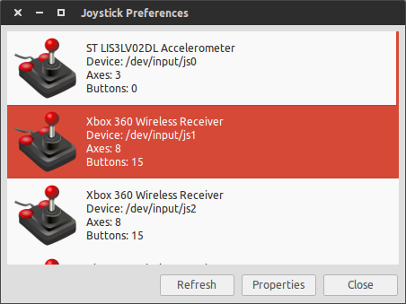

.. _faq:

F.A.Q.
======

How do I find out the ID number my joystick?
--------------------------------------------

You can use **jstest-gtk** to find that out. To install it, run ::

  sudo apt-get install jstest-gtk

and run it on the terminal. It will open a window as seen below. The joystick
devices are named **/dev/input/js1** for the device #1. You can use this index
for the launch files that have the input option **joy_id**.

My machine doesn't seem to see the services and topics from the roscore running remotely
----------------------------------------------------------------------------------------

If you are having trouble running your application in multiple computers, you
can try adding the hostnames and IP addresses of your machines to the
**/etc/hosts** file of the computer running **roscore**.

After running catkin build, I still can't start any nodes or launch files
-------------------------------------------------------------------------

If after compiling your catkin workspace using **catkin build** ROS seems to not 
update the paths to the packages even after you run ::

  cd ~/catkin_ws
  source devel/setup.sh

you can try disabling the option to source the **install** folder of your catkin 
workspace by running ::

  cd ~/catkin_ws
  catkin config --no-install
  catkin clean --all

Then rebuild your workspace ::

  cd ~/catkin_ws
  catkin build
  source devel/setup.sh

The Gazebo worlds don't start when running the simulation on a virtual machine
------------------------------------------------------------------------------

Even though using a virtual machine can lead to the performance of the simulation being 
very poor, to avoid segmentation faults when starting Gazebo in a virtual machine you can
add the following line to your **~/.bashrc** file ::

  export LIBGL_ALWAYS_SOFTWARE=1

.. note::

  If you are running VirtualBox, remember to install the guest additions to your virtual 
  machine as well.