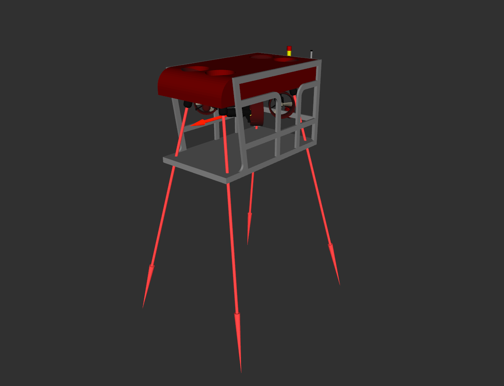

.. _config_thruster_manager:

Configuring the thruster manager for a new vehicle
==================================================

In order to generate control forces for thruster-actuated vehicles, it is
necessary to compute the **thruster allocation matrix**, which will translate
the output of the controller :math:`\boldsymbol{\tau}_C = (f_x, f_y, f_z, \tau_r, \tau_p, \tau_y)^T`
represented in the vehicle's body frame, where :math:`f_i` represents the forces
and :math:`\tau_i` represents the torques, into the output thruster forces
:math:`\tau_i` for each.

The simulation expects each thruster unit to have its own unique frame, which
enables the use of `tf <http://wiki.ros.org/tf>`_ to lookup the transformation
matrix between the vehicle's body frame and each thruster during runtime.
Using this possibility, a package called **uuv_thruster_manager** has been
developed to generate the thruster allocation matrix automatically and
translating the control vector into commands to each thruster.

.. seealso::

  Check the tutorial :ref:`create_new_vehicle` to check on how to setup
  the new vehicle and actuators properly.

To create an initial package with the control configuration for a new vehicle,
run the following in your catkin workspace ::

  rosrun uuv_assistants create_thruster_manager_configuration --robot_name <ROBOT_NAME>

This script will create a new **<ROBOT_NAME>_control** package with initial
templates for the launch and parameter files. If you already have catkin package
where you want to store these files, run ::

  rosrun uuv_assistants create_thruster_manager_configuration --robot_name <ROBOT_NAME> --output_dir <CATKIN_PKG>

The folder structure will look like the following ::

  <ROBOT_NAME>_control
  |-- config
      |-- thruster_manager.yaml
  |-- launch
      |-- start_thruster_manager.launch
  `-- CMakeLists.txt
  `-- package.xml
  
You should edit the **thruster_manager.yaml** file to include the correct
thruster model parameters and topics. Instructions on how to do it can be found
in the comments on the same file.  Here is an example from the RexROV
vehicle thruster manager configuration:

.. literalinclude:: ../../../uuv_control/uuv_thruster_manager/config/rexrov/thruster_manager.yaml

Once the configuration is done, the thruster allocation matrix file should be
generated and store. The TAM matrix can be generated in runtime everytime the
simulation starts, but it is recommended to store and read it from a file since
the **tf_listener** can take a long time to find all frames and will therefore
make the vehicle inactive for a while at the beginning of the simulation.
To do this, you must compile you catkin workspace ::

  cd ~/catkin_ws
  catkin_make

or ::

  cd ~/catkin_ws
  catkin build

.. note::

    You can run ::

      cd ~/catkin_ws
      source devel/setup.sh

    if after compiling your package seems to not be found.

A **TAM.yaml** file will be stored in the **config** folder once you start a
Gazebo world ::

  roslaunch uuv_descriptions empty_underwater_world.launch

and then include the vehicle ::

  roslaunch <ROBOT_NAME>_description upload.launch

and finally run ::

  roslaunch <ROBOT_NAME>_control start_thruster_manager.launch reset_tam:=true

From now on, if you always start the thruster manager using the launch file
above (using the **reset_tam** as **false**), you can load the TAM matrix.

To command the vehicle, you have to start the thruster manager and publish a
`ROS Wrench message <http://docs.ros.org/api/geometry_msgs/html/msg/Wrench.html>`_
to the input topic ::

  /<ROBOT_NAME or ROBOT_NAMESPACE>/thruster_manager/input

with the wrench command to the vehicle. The thrust forces will be generated
at each thruster's unit frame like in the RViz screenshot below.

