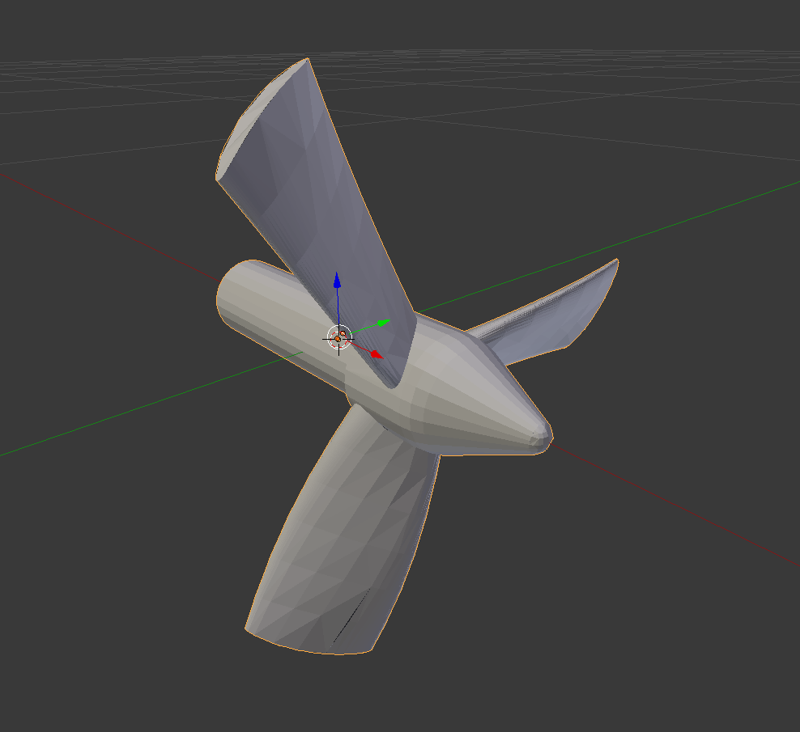

.. _create_new_vehicle:

Creating a new underwater vehicle model
=======================================

To create the catkin package and file structure necessary to create a new
underwater vehicle, you can run the following script in your catkin workspace ::

  rosrun uuv_assistants create_new_robot_model --robot_name <ROBOT_NAME>

This will create a catkin package named **<ROBOT_NAME>_description** with
templates for launch and URDF files. The snippets to use the UUV simulator's
plugins are included and should be modified in order to be used. The template
files do **NOT** describe any vehicle in particular. Meshes should also be
included by the user in the **meshes** folder. The complete folder structure
can be seen below. ::

  <ROBOT_NAME>_description
  |-- launch
      |-- upload.launch
  |-- meshes
      |-- README.md
  |-- robots
      |-- default.xacro
  |-- urdf
      |-- actuators.xacro
      |-- base.xacro
      |-- gazebo.xacro
      |-- sensors.xacro
      |-- snippets.xacro
  `-- CMakeLists.txt
  `-- package.xml

Actuators and vehicles are modeled separately in the robot description and
should also have separate mesh files. The thruster plugin macros set the
axis of rotation of the thruster as the X axis, so it is better to setup the
mesh accordingly, like in the example below showing the mesh for the RexROV
thruster.

.. note::

  Check the page :ref:`config_thruster_manager` to see how to setup the
  thruster allocation matrix and configure the thruster manager node for the
  vehicle.

The fin plugin macros available in  set the fin joint to rotate around the
Z axis, so the fin mesh can be positioned as in the image below to avoid
configuring its origin and orientation in the URDF file.

.. image:: ../images/tutorial_new_vehicle/fin_mesh.png

The template files should have the necessary macros for ROVs, AUVs and simple
surface vessels. If you want to check more macros of URDF snippets for UUV
simulator plugins, you should check the `uuv_gazebo_ros_plugins XACRO macros <https://github.com/uuvsimulator/uuv_simulator/tree/master/uuv_gazebo_plugins/uuv_gazebo_ros_plugins/urdf>`_
and the `uuv_sensor_plugins_ros XACRO macros <https://github.com/uuvsimulator/uuv_simulator/tree/master/uuv_sensor_plugins/uuv_sensor_plugins_ros/urdf>`_.

.. note::

  The position and orientation for sensors, actuators and center of buoyancy
  must be set with respect to the center of gravity of the vehicle's base link.
  ROS and Gazebo also use per default the `ENU (East-North-Up) reference frame <http://www.ros.org/reps/rep-0103.html>`_
  convention, not NED (North-East-Down).
