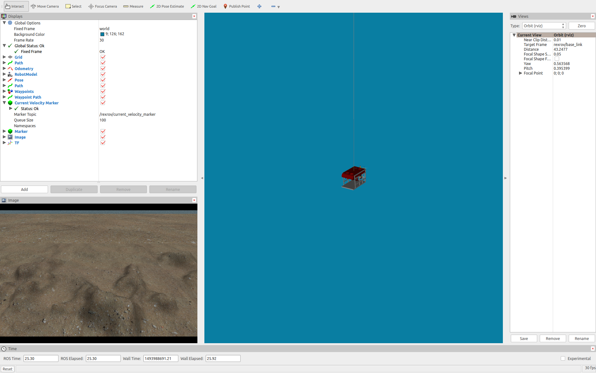
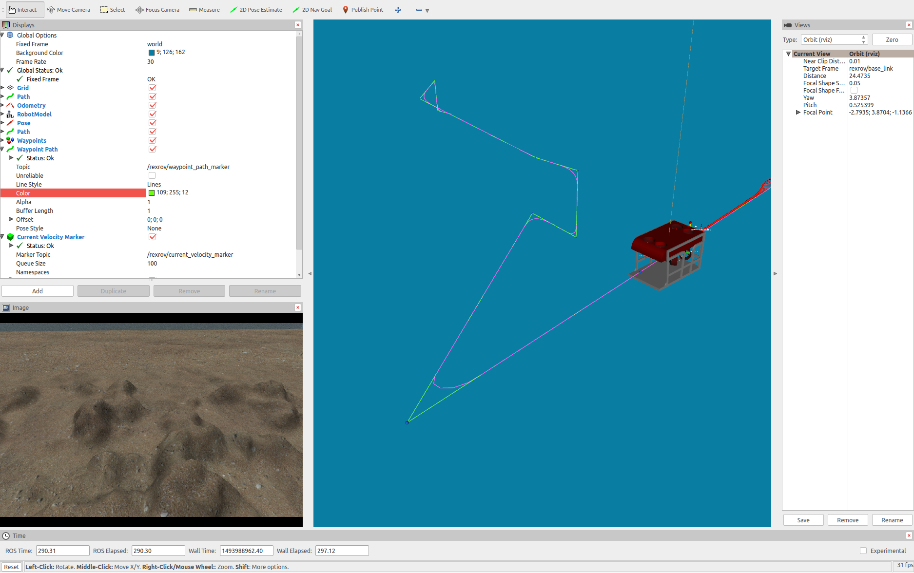

.. _creating_new_dp_controller:

Creating a new custom dynamic positioning controller
====================================================

To facilitate the implementation of new control algorithms for the vehicle modelled in this package, a few Python modules were created as an interface to
the vehicle's thruster manager, the local planner and setup the necessary publishers and subscribers needed to receive trajectory messages and send
thruster commands. The module also includes an implementation of Fossen's equations of motion that can be used by model-based controllers. To create a
controller based on this Python modules, see the following steps. All the files discussed below are available in the package `uuv_tutorial_dp_controller <https://github.com/uuvsimulator/uuv_simulator/tree/master/uuv_tutorials/uuv_tutorial_dp_controller>`_
in the `uuv_tutorials <https://github.com/uuvsimulator/uuv_simulator/tree/master/uuv_tutorials>`_ folder. Remember to change the name of the package when developing your own module to avoid conflicts when compiling the catkin
workspace.

Creating the custom controller package
--------------------------------------

First, a new catkin package will be created to include the scripts and launch files necessary for this implementation. Replace the name of the
catkin workspace **catkin_ws** below if yours is named differently. ::

  cd ~/catkin_ws/src
  catkin_create_pkg uuv_tutorial_dp_controller

This command will create the necessary files for the new package which will be edited further on in this tutorial. Next, two folders are needed,
one **launch** folder to the launch files and one **scripts** folder, where the implementation of the custom controller will be stored. ::

  cd ~/catkin_ws/src/uuv_tutorial_dp_controller
  mkdir launch scripts

Creating the controller node
----------------------------

In the **scripts** folder, a Python file has to be created, here we will name it **tutorial_dp_controller.py**. ::

  touch scripts/tutorial_dp_controller.py

This file will have the implementation of the controller named **TutorialDPController**, a very simple PID controller, as shown below.

.. literalinclude:: ../samples/tutorials/custom_dp_controller.py
  :language: python
  :linenos:

Analyzing the file in detail, for the controller to use the controller modules from **uuv_control_interfaces**, it has to inherit
the **DPControllerBase** class and initialize it

.. literalinclude:: ../samples/tutorials/custom_dp_controller.py
  :language: python
  :lines: 6-8

This will setup the super class to initialize, for example, odometry message subscribers and thruster manager topic publishers.
For model-based controllers, the super class constructor has to be called as

.. code-block:: python

  super(TutorialDPController, self).__init__(self, is_model_based=True)

The controller's parameters, in this case **Kp**, **Kd** and **Ki** should retrieved from the parameter server to allow the controller
to be used in different configurations. One alternative is to read this information from the node's private parameter namespace as shown
below. This is done by adding a **~** in front of the parameters's tag. The parameter has to be provided at the controller's launch file
accordingly, which will be discussed later on.

.. code-block:: python

  if rospy.get_param('~Kd'):
    diag = rospy.get_param('~Kd')
    if len(diag) == 6:
        self._Kd = np.diag(diag)
        print 'Kd=\n', self._Kd
    else:
        # If the vector provided has the wrong dimension, raise an exception
        raise rospy.ROSException('For the Kd diagonal matrix, 6 coefficients are needed')

The **_reset_controller** method can be overriden in case internal variables must be reset when the reset service call is received.
It is important to also call the super class' reset method as seen below to ensure that error and reference vectors are also going
to be cleared.

.. code-block:: python

  super(TutorialDPController, self)._reset_controller()

When using the super class **DPControllerBase**, there is no need to add an controller update sequence or a timer. Once the method
**update_controller** is implemented in the controller class, it will be given as a callback function to the odometry update method.
This update method should include the controller's algorithm and generate the control effort vector (in this case **tau**) and use the
super class function **publish_control_wrench** to publish it to the thruster manager input.

The last part of the file is necessary for the ROS node to be executed.

.. literalinclude:: ../samples/tutorials/custom_dp_controller.py
  :language: python
  :lines: 63-73

Configuring the launch files
----------------------------

Once the custom controller is done, you have to turn your Python script into an executable and it can be done as follows, otherwise
you will not be able to start the ROS node. ::

  chmod u+x tutorial_dp_controller.py

Next step is to setup the launch file for the new controller. Create a new launch file as follows ::

  cd ~/catkin_ws/src/uuv_tutorial_dp_controller/launch
  touch start_tutorial_dp_controller.launch

Edit the file to include the following

.. literalinclude:: ../samples/tutorials/custom_dp_controller.launch
  :language: xml
  :linenos:

The most important parts of the launch file to notice is that the vehicle
namespace **uuv_name** must always be provided, since the simulation per
default will have nodes specific to the operation of each vehicle created inside
their namespaces. The thruster manager must also be initialized.

.. note::

  For more information on how to setup the thruster manager, check the tutorial
  :ref:`config_thruster_manager`.

Finally, the controller node has to be called, along with the correct parameters
set by the arguments **Kp**, **Kd** and **Ki** in this example. You can pass
this parameters by command line or set default vectors as seen above, but there
should be no spaces between commas and values. They have to be set in the
**rosparam** block. The **trajectory_marker_publisher** is an optional node
used only to publish visual markers.

To start a small demonstration using the RexROV vehicle, you can create another
launch file as follows ::

  cd ~/catkin_ws/src/uuv_tutorial_dp_controller/launch
  touch start_tutorial_dp_controller_demo.launch

and initialize a world, the vehicle and the RViz visualization tool as follows

.. literalinclude:: ../../../uuv_tutorials/uuv_tutorial_dp_controller/launch/start_tutorial_dp_controller_demo.launch
  :language: xml

Before you can run this demo, the package has to be configured.

Configuring the package
-----------------------

To allow catkin to install all your modules, you can open the **CMakeLists.txt**
file from your catkin package and edit it to look like in the example below.

.. literalinclude:: ../../../uuv_tutorials/uuv_tutorial_dp_controller/CMakeLists.txt

Running the simulation
----------------------

After you compile you workspace again with **catkin_make** or **catkin build**,
you can run the demo launch file created before. ::

  roslaunch uuv_tutorial_dp_controller start_tutorial_dp_controller_demo.launch

This will start the Gazebo simulator with an instance of the RexROV vehicle with
this custom controller being used for positioning.

You can use one the modules from the `uuv_control_utils` package to send the
vehicle some waypoints and see the controller in action. For example, use the
`default list of waypoints <https://github.com/uuvsimulator/uuv_simulator/blob/master/uuv_control/uuv_control_utils/config/example_waypoints.yaml>`_
and send them to the controller by using ::

  roslaunch uuv_control_utils send_waypoints_file.launch uuv_name:=rexrov

The local planner in **uuv_control_interfaces** that is used per default by the
**DPControllerBase** class will receive the waypoints and apply a linear
interpolation with polynomial blends to generate a path to be followed by the
vehicle.

