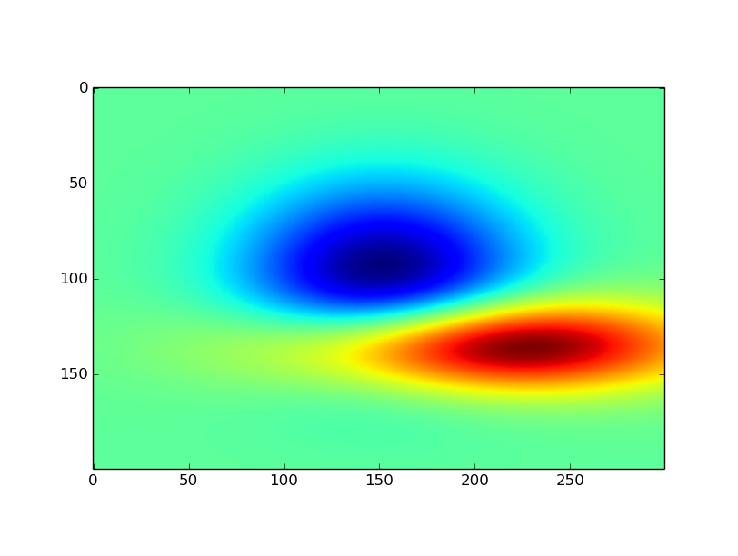
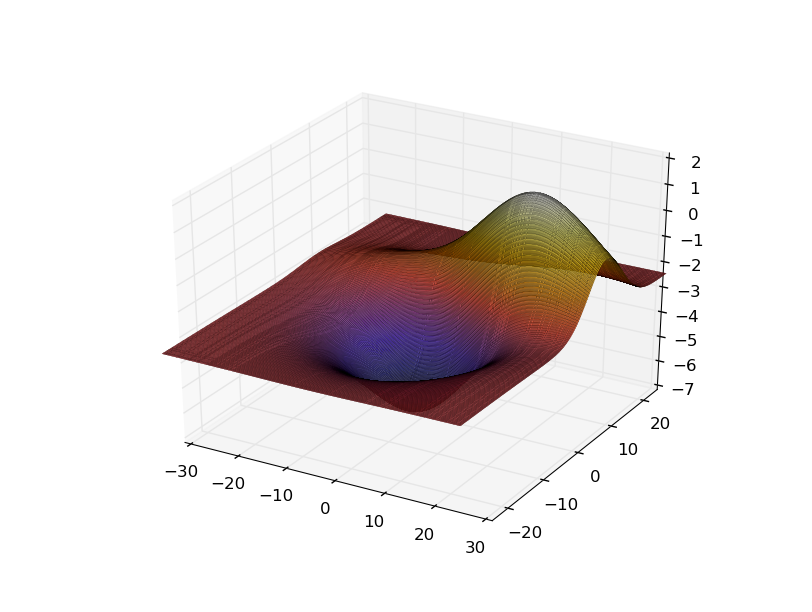
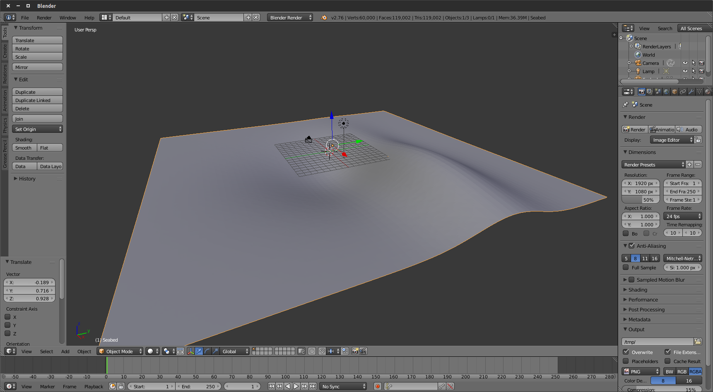
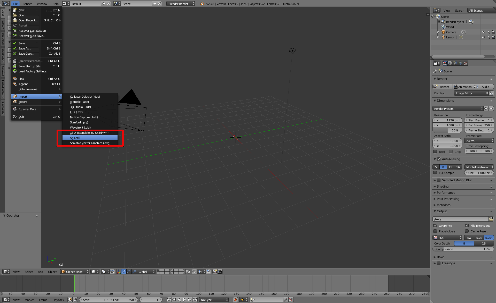
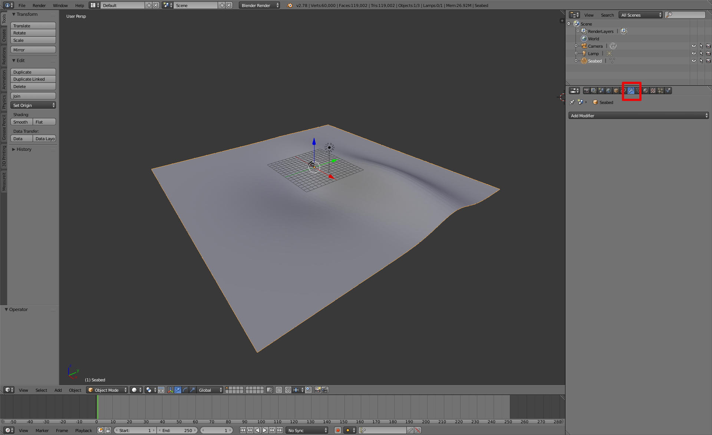
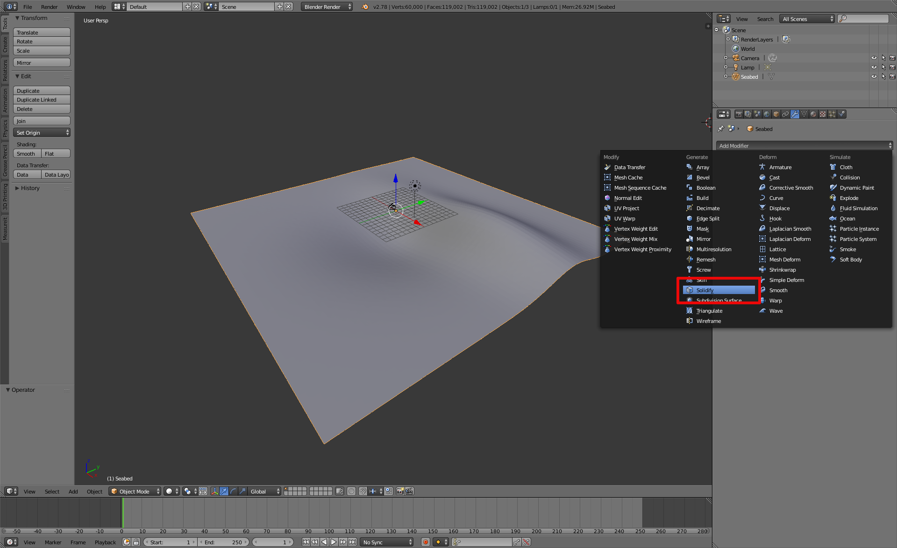
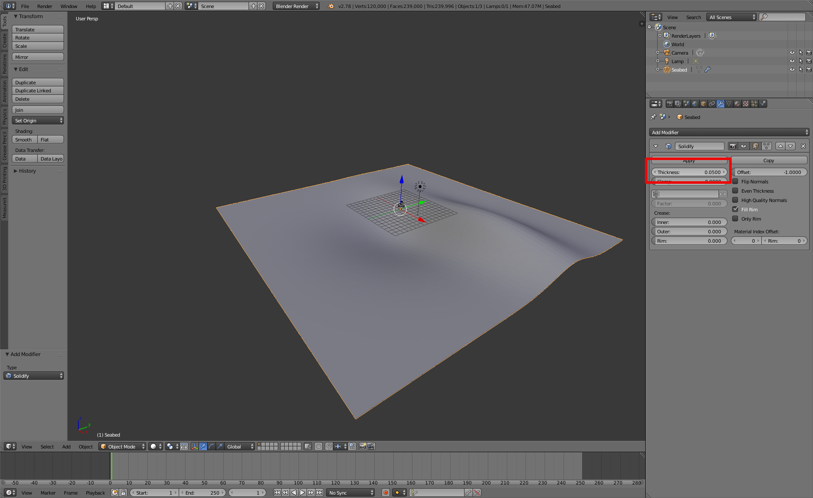
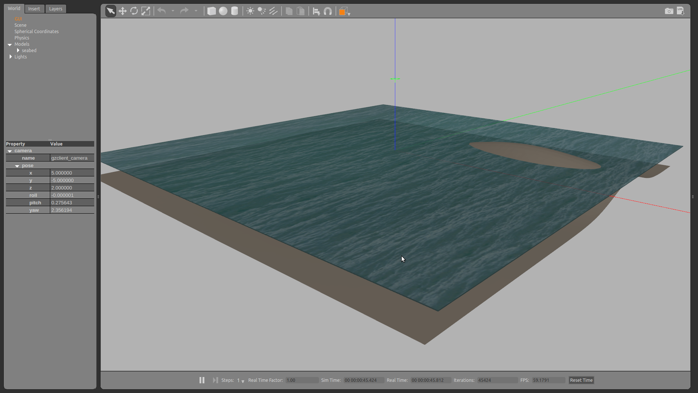
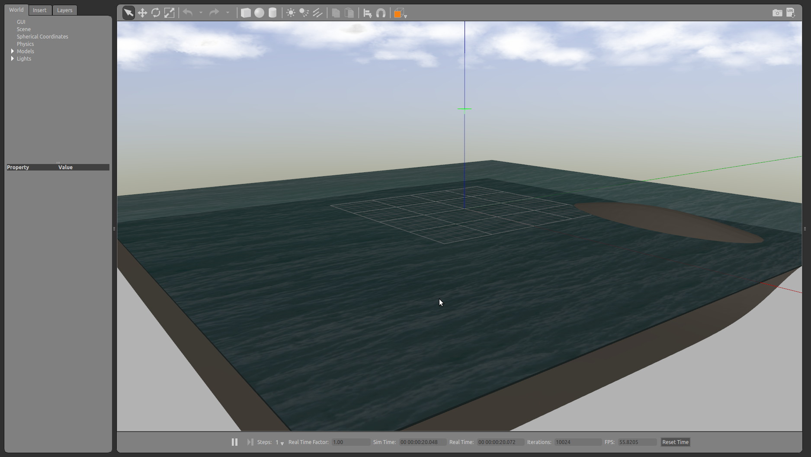

.. _seabed_world:

Making a simple seabed world model
==================================

For the following tutorial, all the files can also be found in the
`uuv_tutorial_seabed_world <https://github.com/uuvsimulator/uuv_simulator/tree/master/uuv_tutorials/uuv_tutorial_seabed_world>`_ package.

The seabed can be critical in simulation scenarios where the objective is, for example, to use UUVs for bathymetric mapping or just to make
the scenario look more realistic.

Gazebo already has a feature to generate heightmaps from grayscale images (see the video below). This is a very quick way to
setup a heightmap, but it can happen that its complexity might make the simulation run slower when trying to interact with it.

.. raw:: html

  <iframe src="https://player.vimeo.com/video/58409707" width="640" height="360" frameborder="0" webkitallowfullscreen mozallowfullscreen allowfullscreen></iframe>
  
<a href="https://vimeo.com/58409707">Gazebo: Heightmap Tutorial</a> from <a href="https://vimeo.com/osrfoundation">OSRF</a> on <a href="https://vimeo.com">Vimeo</a>.

Another option is to take an existent point cloud of a seabed and convert it into a mesh that can be imported in Gazebo like any other model.

Creating the mesh file
----------------------

Measurement data can be sparse and have outliers that need to be removed before generating the mesh. The script below is an example on how the measurement
data can be interpolated into a grid and later converted into an STL file. For this example, we will use the test surface available in the **matplotlib**
package, but you should replace it with your own point cloud data. You will also need the packages **numpy**, **scipy** and **numpy-stl**.

To install the necessary packages, you can use **pip** ::

  sudo apt-get install python-pip
  sudo pip install numpy scipy matplotlib numpy-stl

To generate the mesh, change the code below to your needs

.. literalinclude:: ../samples/tutorials/seabed_gen.py
  :language: python

Below you can see the resulting heightmap as an image

and the triangulated grid used for the creation of the seabed

Now a **seabed.stl** data has been created or you can download it `here <https://github.com/uuvsimulator/uuv_simulator/blob/master/uuv_tutorials/uuv_tutorial_seabed_world/models/tutorial_seabed/meshes/seabed.stl>`_.
You can open it using `MeshLab`_ or `Blender`_. Here we will use Blender to show
the surface. You can also use Blender to edit the mesh, if necessary.

Even though the surface is ready, if you import it in Gazebo as it is you might
not be able to have contact forces if you hit the seabed with your robot. One
way to solve it is to import the STL in Blender using the STL importer tool

and once the surface is uploaded, go to the **Modifiers** section of the right
panel as follows

and choose the option **Solidify** in the **Add modifier** popup menu.

Enter a value for the surface's thickness as shown below and click on the button
**Apply**.

You can now export you surface again using the STL exporter tool. Now you need
to create a `SDF`_ model description of your seabed to load it in Gazebo.

Creating the Gazebo seabed model
--------------------------------

.. seealso::

      For the further steps, be sure to have followed the installation
      instructions that can be found in this page: :ref:`installation`.

To be able to load your seabed mesh in Gazebo, you need a SDF model describing
it. Starting from the folder structure, let's create a new catkin package for
this world description. The folder structure below is only a suggestion based
on the structure used in this package. ::

  cd ~/catkin_ws/src
  catkin_create_pkg uuv_tutorial_seabed_world
  cd uuv_tutorial_seabed_world
  mkdir models worlds launch
  mkdir -p models/tutorial_seabed/meshes

Let's create the files for our seabed model. ::

  cd ~/catkin_ws/src/uuv_tutorial_seabed_world/models/tutorial_seabed
  touch model.config model.sdf

Now copy the **seabed.stl** file into the folder
**uuv_tutorial_seabed_world/models/tutorial_seabed/meshes**.

For the Gazebo seabed model, you will need to create the following files in
your **uuv_tutorial_seabed_world/models/tutorial_seabed** folder. The materials
used below come from UUV simulator's `materials description <https://github.com/uuvsimulator/uuv_simulator/tree/master/uuv_descriptions/Media/materials>`_.
You can replace them for other textures. You can change them to, for example,
the `default materials provided by Gazebo <https://bitbucket.org/osrf/gazebo/src/7d7c37d66d00f1e5e3d96a90734bc61f1f75d8eb/media/materials/scripts/gazebo.material?at=default&fileviewer=file-view-default>`_.

- **model.config**

.. literalinclude:: ../../../uuv_tutorials/uuv_tutorial_seabed_world/models/tutorial_seabed/model.config
  :language: xml

- **model.sdf**

.. literalinclude:: ../../../uuv_tutorials/uuv_tutorial_seabed_world/models/tutorial_seabed/model.sdf
  :language: xml

Now you can configure your **catkin package** so that the model can be listed in
Gazebo as a model. For that you'll have to configure the **package.xml** and
**CMakeLists.txt** files as in the examples below.

- **CMakeLists.txt**

.. literalinclude:: ../../../uuv_tutorials/uuv_tutorial_seabed_world/CMakeLists.txt

- **package.xml**

For this file, be sure to have the following lines:

.. literalinclude:: ../../../uuv_tutorials/uuv_tutorial_seabed_world/package.xml
  :language: xml
  :lines: 17-24

You can now build your workspace as ::

  cd ~/catkin_ws
  catkin_make

or ::

  cd ~/catkin_ws
  catkin build

if you are using **catkin tools**.

Now, if you open Gazebo using ::

  roslaunch gazebo_ros empty_world.launch

and delete the **ground_plane** model under the **Models** list, and then
select the **Tutorial - Seabed** model from the list at the **Insert** tab,
you will be able to see the following screen

Creating a new Gazebo world
---------------------------

Now that the model is done, you can create a Gazebo world to load your scenario
with the seabed model. Create a new world file as follows ::

  roscd uuv_tutorial_seabed_world/worlds
  touch example_underwater.world

and a **launch** file to start it ::

  roscd uuv_tutorial_seabed_world/launch
  touch tutorial_seabed_world.launch

The contents of both files can be seen below

- **example_underwater.world**

.. literalinclude:: ../../../uuv_tutorials/uuv_tutorial_seabed_world/worlds/example_underwater.world
  :language: xml

- **tutorial_seabed_world.launch**

.. literalinclude:: ../../../uuv_tutorials/uuv_tutorial_seabed_world/launch/tutorial_seabed_world.launch
  :language: xml

Now you can launch your world using ::

  roslaunch uuv_tutorial_seabed_world tutorial_seabed_world.launch

and the result on the screen should be

Done! Now the custom seabed can be used for your simulation.

.. _MeshLab: http://meshlab.sourceforge.net/
.. _Blender: https://www.blender.org/
.. _SDF: http://sdformat.org/
