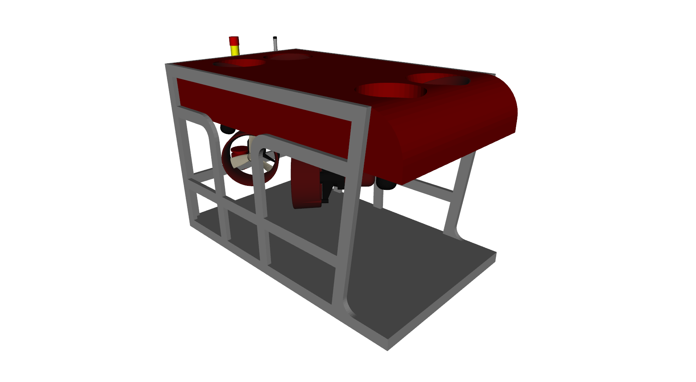
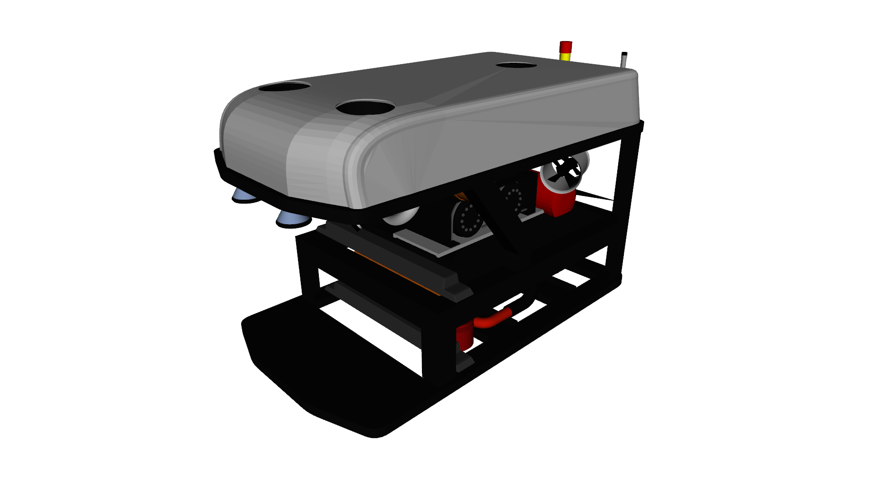
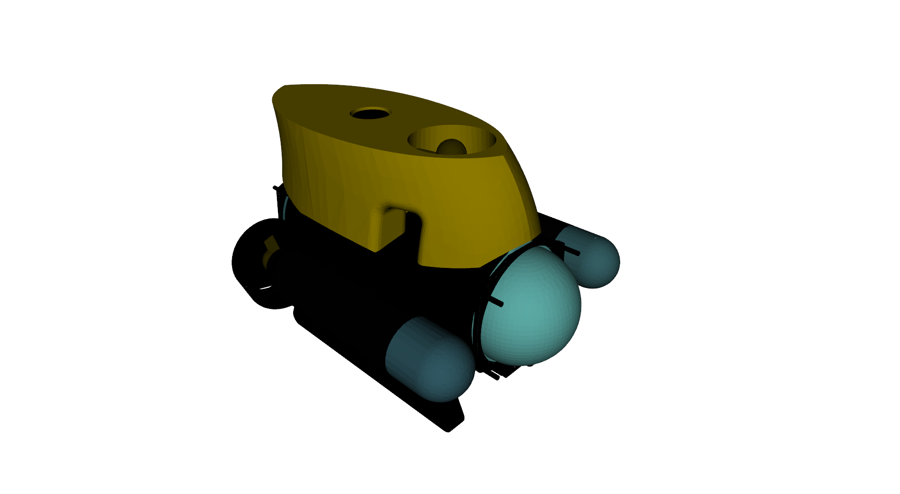
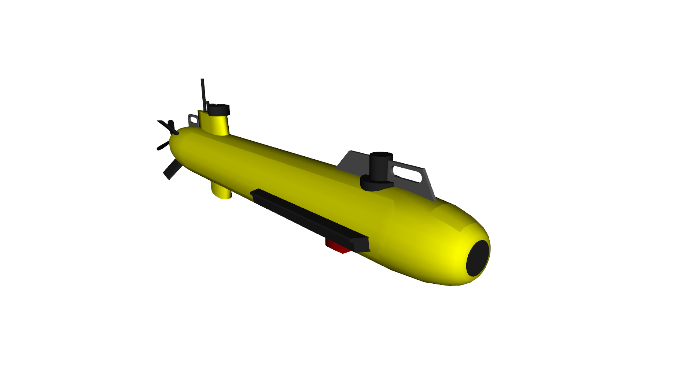

.. _vehicles:

Vehicles available
==================

.. _rexrov:

RexROV
------

This is the test vehicle available in the UUV simulator package. The RexROV is
a fully thruster actuated remotely operated vehicle for which the dimensions
and hydrodynamic parameters are derived from the parameters for the SF 30k ROV
available in :cite:`Berg_2012`. It has a different thruster configuration from
the SF 30k, with a total of 8 thruster units.

This vehicle model is included in the UUV simulator package as the default test
vehicle. To run a demo, use the following ::

  roslaunch uuv_gazebo start_pid_demo_with_teleop.launch joy_id:=0

- `RexROV GitHub repository <https://github.com/uuvsimulator/uuv_simulator/tree/master/uuv_descriptions/models/rexrov>`_

.. _rexrov2:

RexROV 2
--------

This vehicle is modeled with equal parameters, dimensions and thruster
configuration as presented in :cite:`Berg_2012`. To run a demo of this vehicle,
clone the repository in your catkin workspace and then run a Gazebo UUV simulator
world ::

  roslaunch uuv_descriptions ocean_waves.launch

and then ::

  roslaunch rexrov2_gazebo start_rexrov2_pid_controller.launch teleop_on:=true joy_id:=0

The teleoperation nodes are pre-configured per default for the XBox 360
controller.

- `RexROV 2 GitHub repository <https://github.com/uuvsimulator/rexrov2>`_

.. _desistek_saga:

Desistek SAGA ROV
-----------------

To run a demo of this vehicle, clone the repository in your catkin workspace and
then run a Gazebo UUV simulator world ::

  roslaunch uuv_descriptions ocean_waves.launch

and the vehicle demo launch file ::

  roslaunch desistek_saga_gazebo start_demo_teleop.launch joy_id:=0

The teleoperation nodes are pre-configured per default for the XBox 360
controller.

- `Desistek SAGA ROV GitHub repository <https://github.com/uuvsimulator/desistek_saga>`_

.. _eca_a9:

ECA A9 AUV
----------

To run a demo of this vehicle, clone the repository in your catkin workspace and
then run a Gazebo UUV simulator world ::

  roslaunch uuv_descriptions ocean_waves.launch

and the vehicle demo launch file ::

  roslaunch eca_a9_gazebo start_demo_teleop.launch joy_id:=0

The teleoperation nodes are pre-configured per default for the XBox 360
controller.

- `ECA A9 AUV GitHub repository <https://github.com/uuvsimulator/eca_a9>`_
